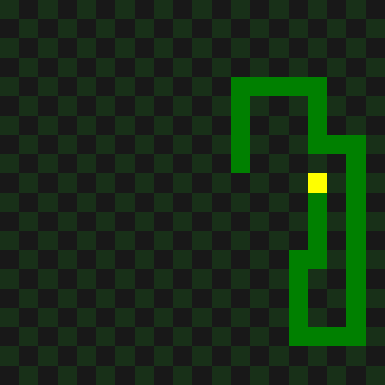

# Snake Game



Platfrom-independent snake game written in pure C.
Can be compiled as console application or WebAssembly binary.

## Setup

Compilation tested on Linux only. Please, check you have `make` and `clang` installed.

```shell
make
```

### Run CLI version
```shell
$ ./bin/debug/snake
```

### Run WebAssembly version
```shell
# serve dist/ directory in a way you like, then open page in a browser
$ npx serve dist/ -l 4321
$ xdg-open http://localhost:4321
```
